**注意**：请在**root**权限下进行操作！！！

## 1. 启动linux

选择安装在opt目录

```bash
cd /opt/
```

## 2. 安装clash

### 2.1 下载clash

```bash
git clone https://github.com/anuouan/linux-clash.git && cd linux-clash/ && rm -rf README.md README.assets/ .git/ .gitignore
```

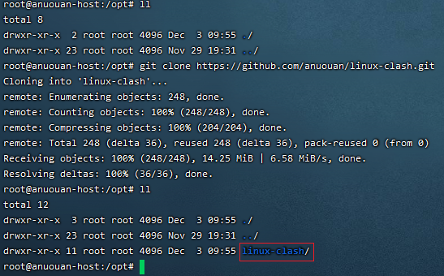

### 2.2 配置订阅地址

进入到项目目录，编辑`.env`文件，添加订阅地址`CLASH_URL`的值。

```bash
cd /opt/linux-clash/
```

```bash
vim .env
```

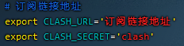

- `CLASH_SECRET`: ui界面的密码，默认密码为：clash

### 2.3 启动程序

- 进入clash目录

```bash
cd /opt/linux-clash/
```

- 运行启动脚本

```bash
sudo bash start.sh
```

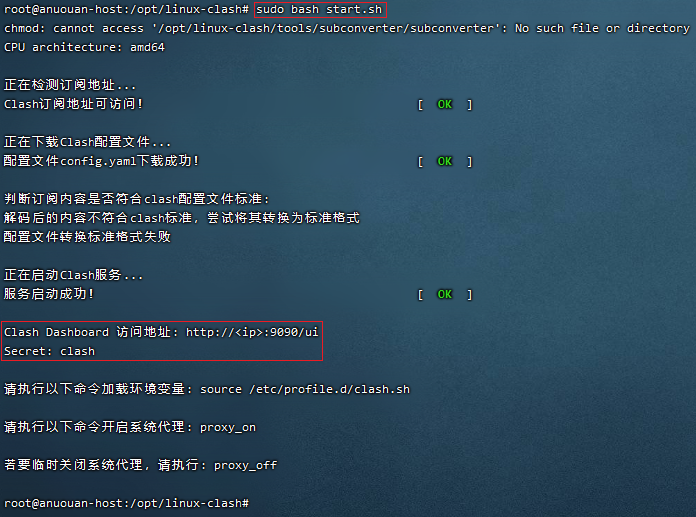

- 添加系统变量

加载并执行 `/etc/profile.d/clash.sh` 脚本。包含一些环境变量的设置，一些初始化命令，用于配置 Clash 代理服务器的环境。

```bash
source /etc/profile.d/clash.sh
```

- 开启系统代理

```
proxy_on
```

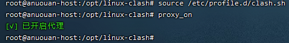

- 检查服务端口

```bash
netstat -tln | grep -E '9090|789.'
```

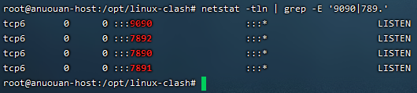

- 检查环境变量

```bash
env | grep -E 'http_proxy|https_proxy'
```

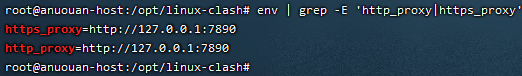

以上步鄹如果正常，说明服务clash程序启动成功了。

- 验证是否生效

```bash
ping docker.com
```

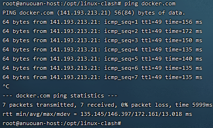

### 2.4 重启程序

如果需要对Clash配置进行修改，请修改 `conf/config.yaml` 文件。然后运行 `restart.sh` 脚本进行重启。

**注意：**
		重启脚本 `restart.sh` 不会更新订阅信息。

### 2.5 停止程序

- 进入clash目录

```bash
cd /opt/linux-clash/
```

- 关闭服务

```bash
sudo bash shutdown.sh
```

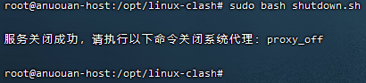

- 关闭系统代理

```bash
proxy_off
```

然后检查程序端口、进程以及环境变量`http_proxy|https_proxy`，若都没则说明服务正常关闭。

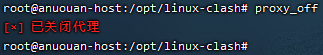

- 检查服务端口

```bash
netstat -tln | grep -E '9090|789.'
```

- 检查环境变量

```bash
env | grep -E 'http_proxy|https_proxy'
```

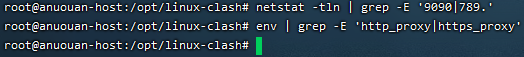

## 3. clash ui界面

- 通过地址访问ui界面

  运行`sudo bash start.sh`启动程序后的输出

  

- 通过浏览器输入地址访问

```bash
http://<ip>:9090/ui
```

\<ip>：换成自己的公网ip地址

- 登录管理界面

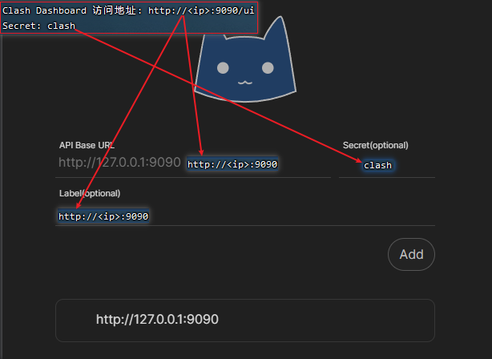