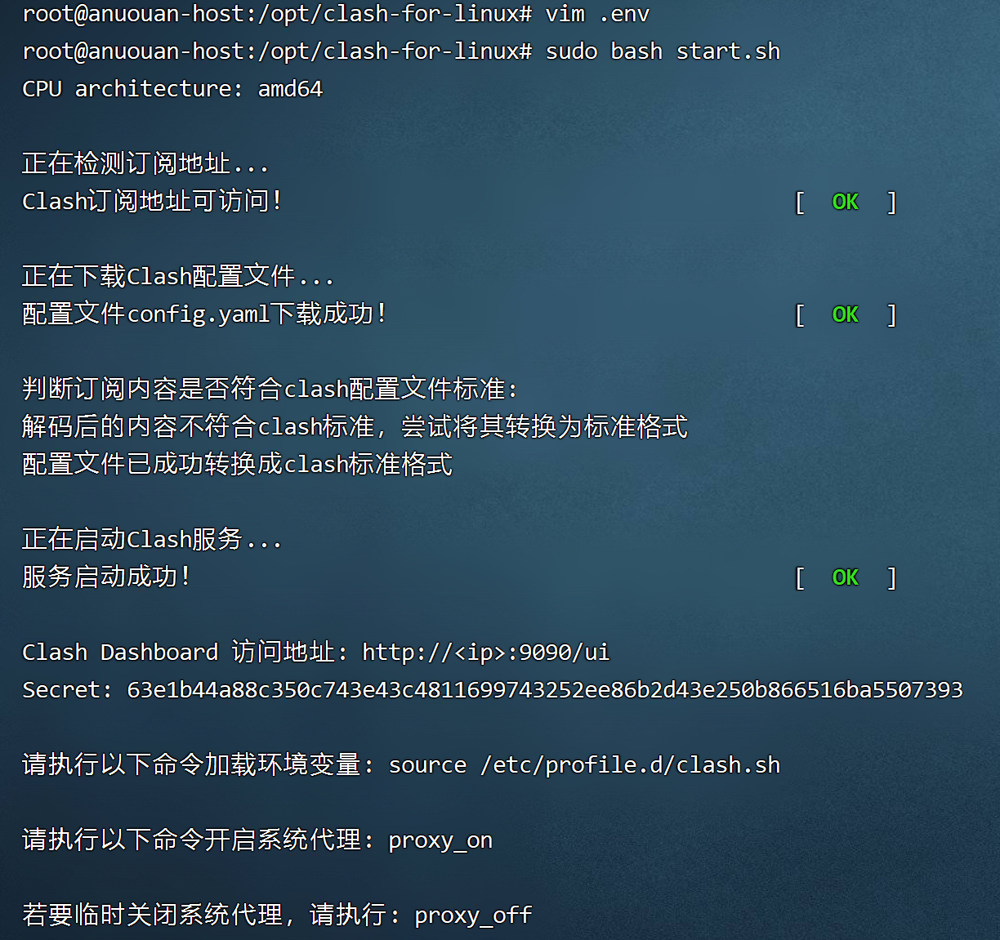
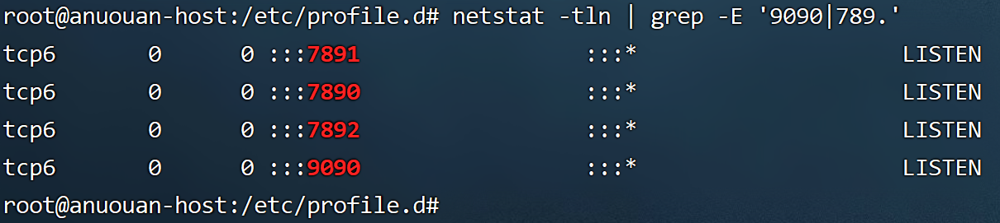

## 下载项目

下载项目

```bash
git 
```

进入到项目目录，编辑`.env`文件，修改变量`CLASH_URL`的值。

```bash
cd clash-for-linux
```

```bash
vim .env
```

> **注意：** `.env` 文件中的变量 `CLASH_SECRET` 为自定义 Clash Secret，值为空时，脚本将自动生成随机字符串。

<br>

## 启动程序

直接运行脚本文件`start.sh`

- 进入项目目录

```bash
cd clash-for-linux
```

- 运行启动脚本

```bash
sudo bash start.sh
```

打印：



- 添加系统变量

加载并执行 `/etc/profile.d/clash.sh` 脚本。包含一些环境变量的设置，一些初始化命令，用于配置 Clash 代理服务器的环境。

```bash
source /etc/profile.d/clash.sh

```

- 开启系统代理

```
proxy_on
```

- 检查服务端口

```bash
$ netstat -tln | grep -E '9090|789.'
tcp        0      0 127.0.0.1:9090          0.0.0.0:*               LISTEN     
tcp6       0      0 :::7890                 :::*                    LISTEN     
tcp6       0      0 :::7891                 :::*                    LISTEN     
tcp6       0      0 :::7892                 :::*                    LISTEN
```

- 检查环境变量

```
env | grep -E 'http_proxy|https_proxy'
```



以上步鄹如果正常，说明服务clash程序启动成功，现在就可以体验高速下载github资源了。

<br>

## 重启程序

如果需要对Clash配置进行修改，请修改 `conf/config.yaml` 文件。然后运行 `restart.sh` 脚本进行重启。

> **注意：**
> 重启脚本 `restart.sh` 不会更新订阅信息。

<br>

## 停止程序

- 进入项目目录

```bash
$ cd clash-for-linux
```

- 关闭服务

```bash
$ sudo bash shutdown.sh

服务关闭成功，请执行以下命令关闭系统代理：proxy_off

```

```bash
$ proxy_off
```

然后检查程序端口、进程以及环境变量`http_proxy|https_proxy`，若都没则说明服务正常关闭。


<br>

## Clash Dashboard

- 访问 Clash Dashboard

通过浏览器访问 `start.sh` 执行成功后输出的地址，例如：http://192.168.0.1:9090/ui

- 登录管理界面

在`API Base URL`一栏中输入：http://\<ip\>:9090 ，在`Secret(optional)`一栏中输入启动成功后输出的Secret。

点击Add并选择刚刚输入的管理界面地址，之后便可在浏览器上进行一些配置。

- 更多教程

此 Clash Dashboard 使用的是[yacd](https://github.com/haishanh/yacd)项目，详细使用方法请移步到yacd上查询。

<br>

# 常见问题

1. 部分Linux系统默认的 shell `/bin/sh` 被更改为 `dash`，运行脚本会出现报错（报错内容一般会有 `-en [ OK ]`）。建议使用 `bash xxx.sh` 运行脚本。

2. 部分用户在UI界面找不到代理节点，基本上是因为厂商提供的clash配置文件是经过base64编码的，且配置文件格式不符合clash配置标准。

   目前此项目已集成自动识别和转换clash配置文件的功能。如果依然无法使用，则需要通过自建或者第三方平台（不推荐，有泄露风险）对订阅地址转换。
   
3. 程序日志中出现`error: unsupported rule type RULE-SET`报错，解决方法查看官方[WIKI](https://github.com/Dreamacro/clash/wiki/FAQ#error-unsupported-rule-type-rule-set)
